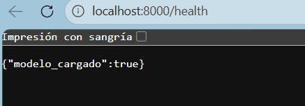
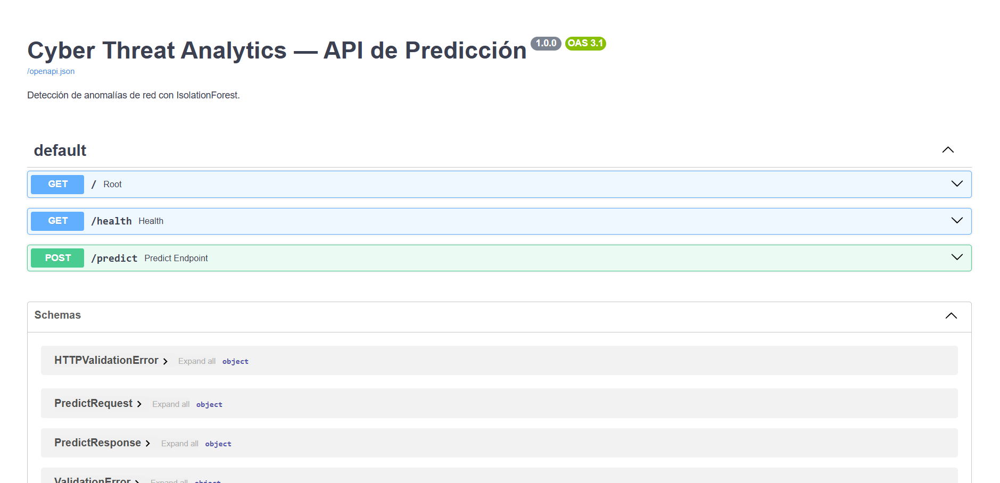
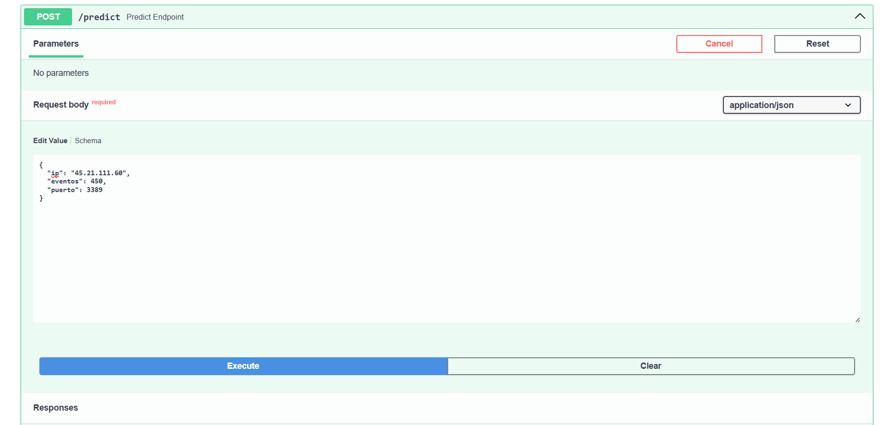
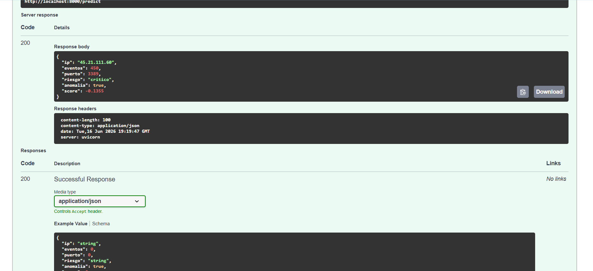

# 🛡️ Cyber Threat Analytics Platform

Plataforma de análisis de datos de ciberseguridad que procesa logs reales,
genera KPIs y dashboards interactivos, y **detecta anomalías con Machine
Learning**, sirviendo predicciones en tiempo real vía una API REST.

Combina **Data Analysis · SQL · Python · Power BI · Machine Learning ·
Ciberseguridad**.

## 🔧 Stack tecnológico

Python · Pandas · NumPy · Scikit-Learn · MySQL · Power BI · Jupyter Notebook ·
FastAPI · Docker · joblib

## 🎯 Qué hace

- Limpia y normaliza logs de firewall, tráfico de red e intentos de login.
- Responde preguntas de seguridad y negocio (EDA) y calcula KPIs.
- Entrena un **IsolationForest** para detectar comportamientos anómalos.
- Expone `POST /predict` para evaluar una IP en tiempo real.
- Prepara un dataset listo para un dashboard de Power BI de 3 páginas (ejecutivo / técnico / incidentes) — ver estado abajo.

## 📁 Estructura

```
cyber-threat-analytics/
├── datasets/                 # logs crudos (CSV)
│   ├── firewall_logs.csv
│   ├── network_traffic.csv
│   └── login_attempts.csv
├── notebooks/                # análisis (ejecutados, con salidas)
│   ├── 01-limpieza_datos.ipynb
│   ├── 02-eda.ipynb
│   ├── 03-kpis.ipynb
│   └── 04-deteccion_anomalias.ipynb
├── dashboards/
│   ├── powerbi_dataset.csv   # tabla lista para Power BI
│   ├── README.md             # guía para construir el .pbix
│   └── capturas/
├── api/                      # API de predicción (FastAPI)
│   ├── main.py
│   ├── predict.py
│   └── model.joblib          # modelo entrenado
├── docs/
│   ├── arquitectura.md
│   ├── modelo_datos.md
│   └── hallazgos.md
├── generate_datasets.py      # genera los CSV (sintéticos, deterministas)
├── build_analysis.py         # limpieza + KPIs + export Power BI
├── train_model.py            # entrena y guarda api/model.joblib
├── build_notebooks.py        # (re)genera los notebooks
├── requirements.txt
└── README.md
```

## 🚀 Cómo ejecutarlo

```bash
# 1. Entorno
python -m venv venv
source venv/bin/activate           # Windows: venv\Scripts\activate
pip install -r requirements.txt

# 2. Pipeline de datos y modelo
python generate_datasets.py        # genera datasets/*.csv
python build_analysis.py           # KPIs + dashboards/powerbi_dataset.csv
python train_model.py              # entrena api/model.joblib

# 3. Notebooks (opcional, exploración)
jupyter notebook                   # abre notebooks/

# 4. API de predicción
uvicorn api.main:app --reload      # http://localhost:8000/docs
```

## 🔮 API de predicción

`POST /predict`

```json
{ "ip": "192.168.1.100", "eventos": 450, "puerto": 3389 }
```

Respuesta:

```json
{
  "ip": "192.168.1.100",
  "eventos": 450,
  "puerto": 3389,
  "riesgo": "critico",
  "anomalia": true,
  "score": -0.12
}
```

| Endpoint | Descripción |
|----------|-------------|
| `GET /` | Healthcheck |
| `GET /health` | Estado del modelo |
| `POST /predict` | Riesgo + anomalía para una IP |

## 📸 Capturas

### Healthcheck de la API


### Documentación Swagger


### Predicción de riesgo (`POST /predict`)



### Dashboard de Power BI
⚠️ **Pendiente de construir.** El dataset ya está listo (`dashboards/powerbi_dataset.csv`,
generado por `build_analysis.py`) y la guía paso a paso para armarlo en Power BI Desktop
está en [`dashboards/README.md`](dashboards/README.md) (~30 min) — el archivo `.pbix` y
sus capturas todavía no existen en este repositorio.

## 📊 Hallazgos destacados

Sobre 18,031 eventos analizados (ver [`docs/hallazgos.md`](docs/hallazgos.md)):

- **Top atacante:** `45.21.111.60` (1,281 eventos).
- **70 anomalías (8%)** detectadas, todas IPs externas `45.x` contra puertos de
  acceso remoto (RDP/SSH/SMB).
- Origen dominante: **China y Rusia**; pico de actividad en **madrugada**
  (ataques automatizados).
- 5,085 intentos de login fallidos → fuerza bruta.

## 📚 Documentación

- [Arquitectura](docs/arquitectura.md)
- [Modelo de datos](docs/modelo_datos.md)
- [Hallazgos](docs/hallazgos.md)
- [Guía del dashboard Power BI](dashboards/README.md)

## ⚠️ Nota sobre los datos

Los datasets se generan de forma **sintética pero realista** con
`generate_datasets.py` (incluyen suciedad intencional para la limpieza). Para
usar datos **reales**, reemplaza los CSV de `datasets/` por los de
[Kaggle](https://www.kaggle.com/datasets) o
[CIC-IDS-2017](https://www.unb.ca/cic/datasets/ids-2017.html) respetando los
nombres de columna documentados en `docs/modelo_datos.md`.

## 👤 Autor

Alejandro Cuesta Rodríguez — Ingeniero en Sistemas Computacionales
